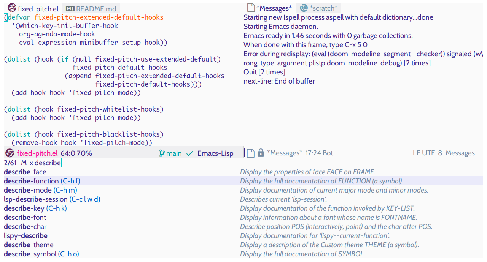
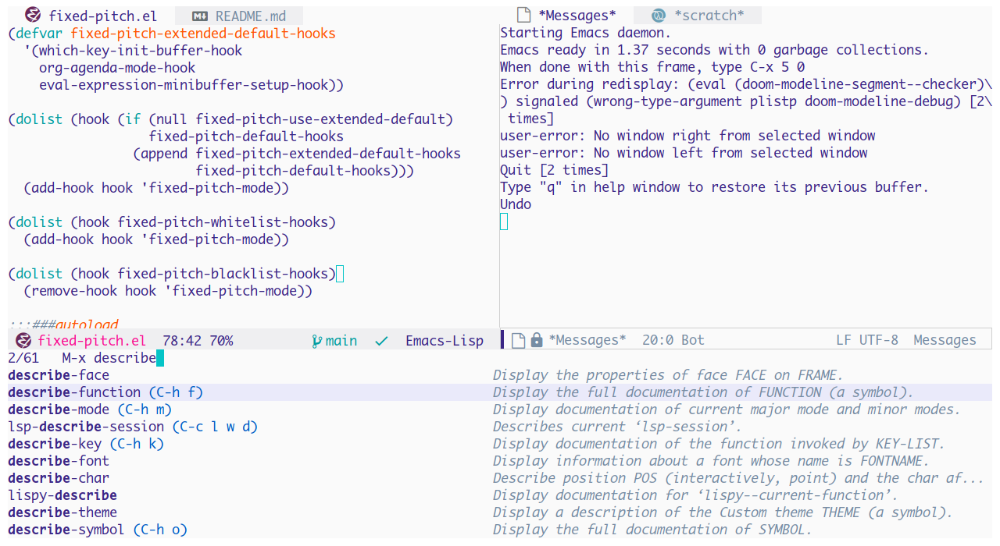

<h1 align="center">Fixed Pitch Mode for Emacs</h1>

<p align="center">

</p>
<p align="center">
<a href="https://github.com/cstby/fixed-pitch-mode"></a>
 
<a href="https://github.com/cstby/fixed-pitch-mode"></a>
<a href="https://www.gnu.org/software/emacs/"></a>
<a href="https://www.gnu.org/licenses/gpl-3.0"></a>
</p>

This package provides `fixed-pitch-mode`, a minor mode for setting a monospaced typeface. This allows you to set a proportional typeface for UI elements while keeping a monospaced typeface for code.

## Why?

Using a monospaced font [increases the readability of code](https://stackoverflow.com/questions/218623/why-use-monospace-fonts-in-your-ide), but do we need it everywhere else? Most applications use proportional fonts for their GUI. However, Emacs seems to assume that you will use a monospaced font as your global default. Although it provides the option to set both `variable-pitch ` and `fixed-width` faces, it only provides a `variable-pitch-mode`. This package is for those who want to only use a monospaced font for code.

## Screenshots

The first screenshot below shows Emacs using `fixed-pitch` with a proportional typeface set as the default.  The emacs-lisp buffer uses a monospaced typeface because `fixed-pitch-mode` is active. The modeline, message buffer, tabs, and mini-buffer all use a proportional font. 

This second screenshot shows the same Emacs configuration without the `fixed-pitch` package. A monospaced typeface is set as the default font, and it's used wherever text is displayed.


### Fixed Pitch Package



### Default Monospaced Font



## Installation

### Manual

Download or clone this repository and place it on your `load-path`. Then add these lines to your `init.el`:

```emacs-lisp
(require 'fixed-pitch)
```

### straight.el

If you use [straight.el](https://github.com/raxod502/straight.el) with the `straight-use-package` macro, you can add the following code to your `init.el` to automatically install the package.

```emacs-lisp
(use-package fixed-pitch
  :straight (:type git :host github :repo "cstby/fixed-pitch"))
```

## Usage

This package is plug and play. You only need to set your default font to a proportional typeface, and you're all set. There are many ways to set your default font, but I personally prefer to include it in my `default-frame-alist`.

```emacs-lisp
(setq-default default-frame-alist '((font . "Helvetica-12")))
```

When `fixed-pitch` is loaded, it will set up hooks to activate `fixed-pitch-mode` for `prog-mode`, `comint-mode`, and other modes designed to display code. If you find yourself in a buffer where you need a monospaced font, you can run `M-x fixed-pitch-mode` to activate this minor mode manually. You can also add new hooks to you fixed-pitch whitelist, as described in the customization section below.

## Customization

### Fonts

Emacs has a built-in `fixed-pitch` face that will be used by `fixed-pitch-mode`.  You can use `customize-set-faces` to set these built-in faces.

```emacs-lisp
(custom-set-faces '(fixed-pitch ((t (:family "Monego" :height 105))))
                  '(variable-pitch ((t (:family "Crimson Pro" :height 140)))))
```

### Cursor

When `fixed-pitch-mode` is enabled, it will locally set the cursor type to `'box`. When disabled, it will set the cursor type to `'bar`.  If you want the cursor to stay the same globally, you can set `fixed-pitch-dont-change-cursor` to `t`.

### Whitelist

If you run across a buffer that you want to always use `fixed-pitch-mode`, you can add it to your whitelist. If you believe a hook should be added to the defaults, please open an issue.

```emacs-lisp
(setq fixed-pitch-whitelist-hooks
	'(cider-mode-hook
	  cider-docview-mode-hook
	  cider-popup-buffer-mode
	  cider-test-report-mode-hook
	  cider-repl-mode-hook))
```

### Extended Default List

Most Emacs packages assume that users have a monospaced typeface globally. Some use spaces for alignment, and others mix prose with code. The extended default list is for hooks that may appeal to some but not all users. You can enable these hooks by setting `(setq fixed-pitch-use-extended-default t)`

### Blacklist

Finally, in the case where you want to use the extended default list but need proportional fonts for mode hooks included in that list, you can add those lists to a blacklist.

### Example Configuration

Here is an example of a (somewhat nonsensical) configuration with `use-package`.

```emacs-lisp
(use-package fixed-pitch
  :straight (:type git :host github :repo "cstby/fixed-pitch"))
  :custom
  (fixed-pitch-whitelist-hooks
   '(cider-mode-hook
     cider-docview-mode-hook
     cider-popup-buffer-mode
     cider-test-report-mode-hook
     cider-repl-mode-hook))
  (fixed-pitch-blacklist-hooks
   '(comint-mode-hook))
  (fixed-pitch-dont-change-cursor t)
  (fixed-pitch-use-extended-default t)
  :config
  (setq-default cursor-type 'bar))
```

## Contributing

Please feel free to send a GitHub pull request to add support for your favorite packages. If you find any bugs or problems, please report them in the issue tracker. I welcome contributions of any kind.

## License

Distributed under the GNU General Public License, version 3.
